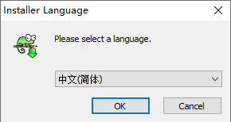
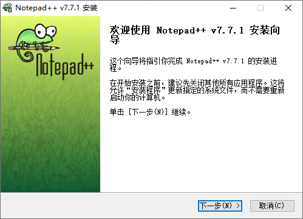
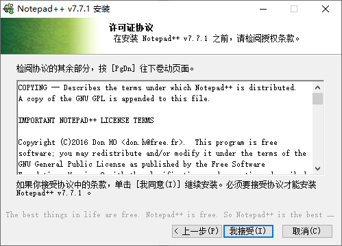
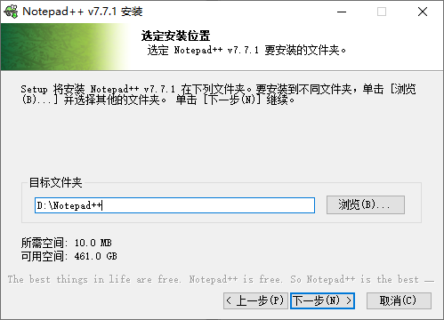
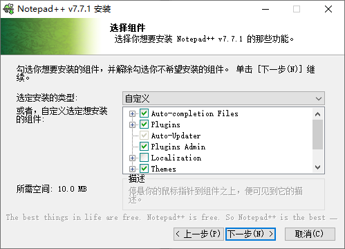
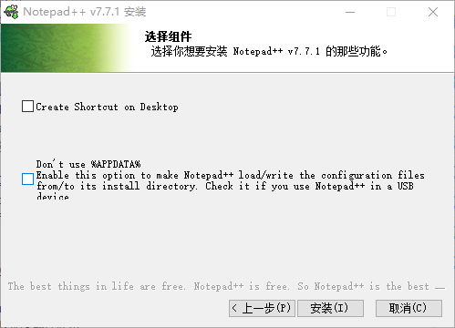
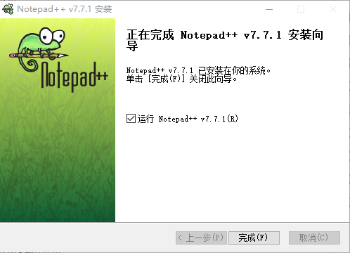
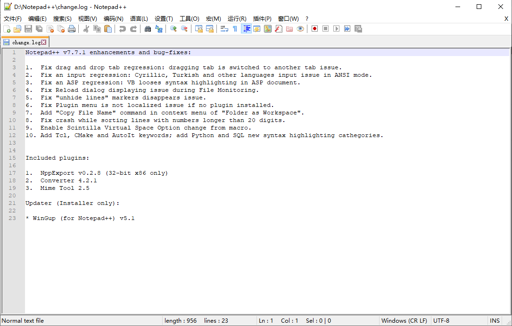
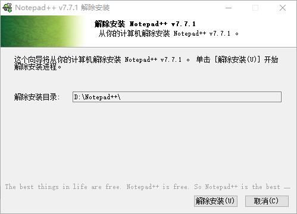

# notepad++使用
- 目录：
  * [下载](#1-下载)
  * [安装](#2-安装)
  * [设置](#3-设置)
  * [使用](#4-使用)
  * [卸载](#5-卸载)
### 1. 下载
官网：https://notepad-plus-plus.org/

[下载地址](https://notepad-plus-plus.org/download/)

[官网安装版64bit](https://notepad-plus-plus.org/repository/7.x/7.7.1/npp.7.7.1.Installer.x64.exe)

[官网安装版32bit](https://notepad-plus-plus.org/repository/7.x/7.7.1/npp.7.7.1.Installer.exe)

[Github安装版64bit](https://github.com/Mecoly/npp-7.7.1)
### 2. 安装

选择语言版本

下一步

我接受

选择安装路径，安装

    Auto-complrtion Files 自动完成
    Plugins 插件
    Auto-Updater 自动更新软件
    plugins Admin 插件管理工具，需要安装上一项
    Localization 其他语言(繁体中文，英文等)
    Themes 改变页面显示
    Context Menu Entry 用notepad++编辑添加到右键菜单

    创建桌面快捷方式
    不添加到apppath 如果安装到移动存储设备(u盘)勾选

完成

软件页面

### 3. 设置

### 4. 使用

### 5. 卸载

运行卸载程序：

解除安装(卸载)

卸载完成
